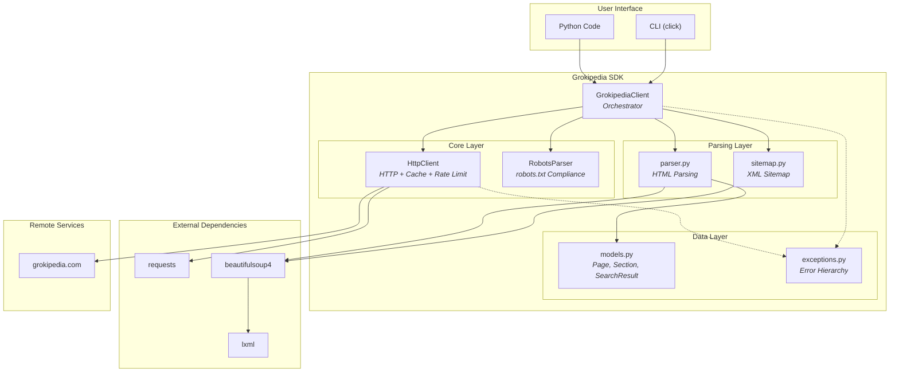
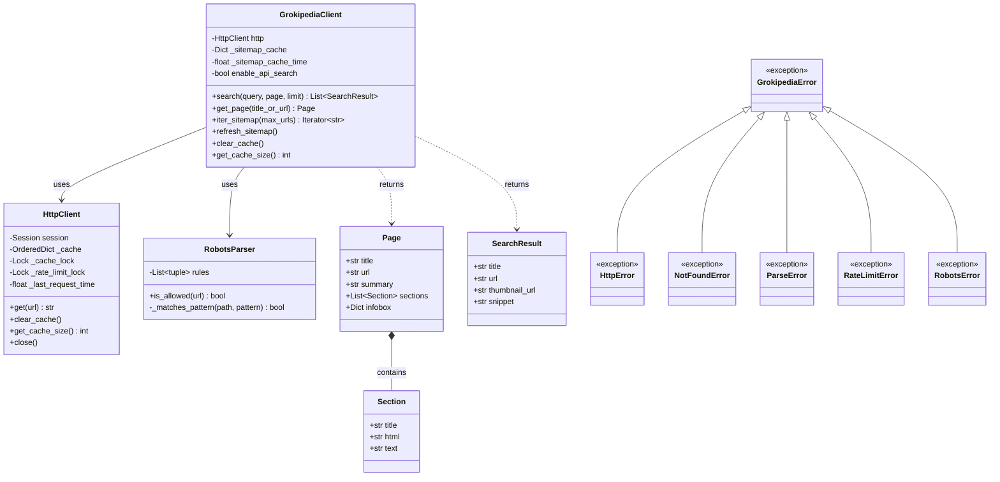
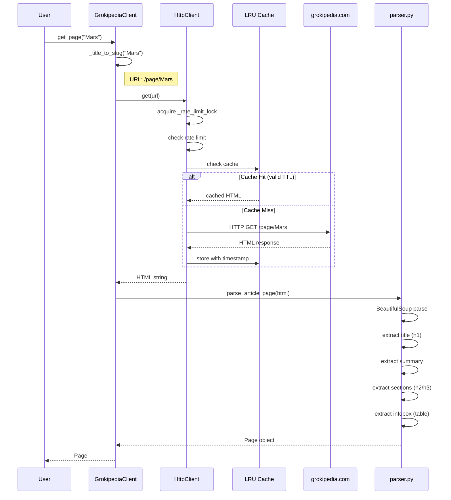
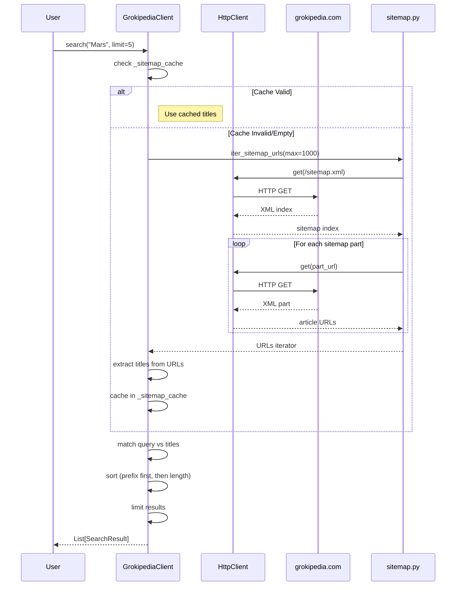
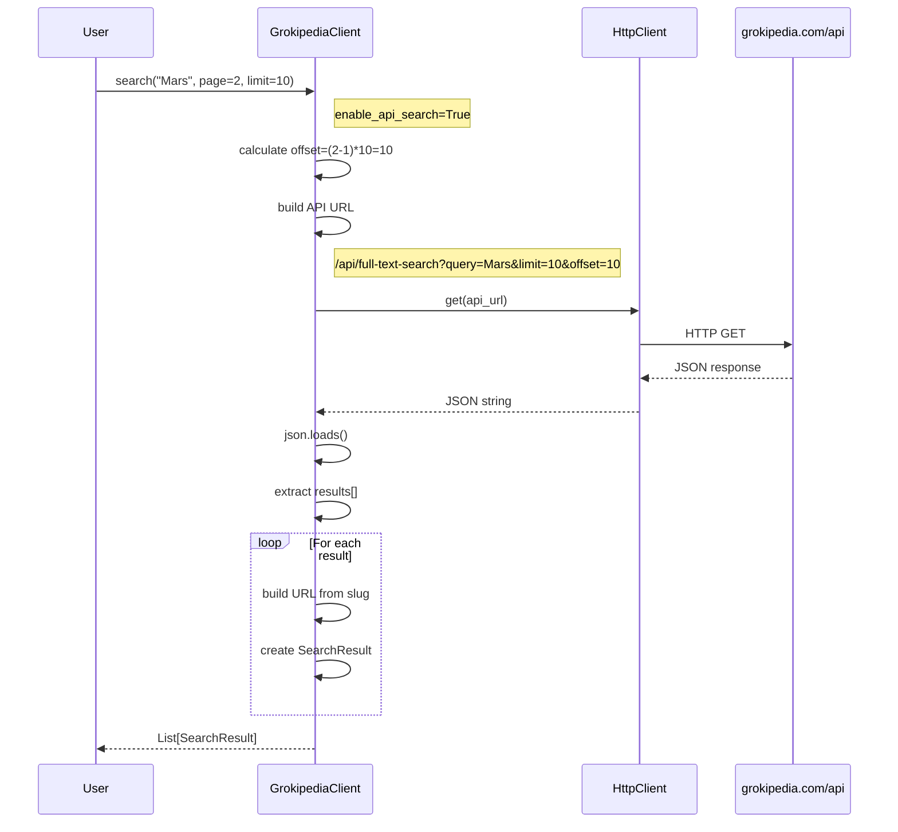
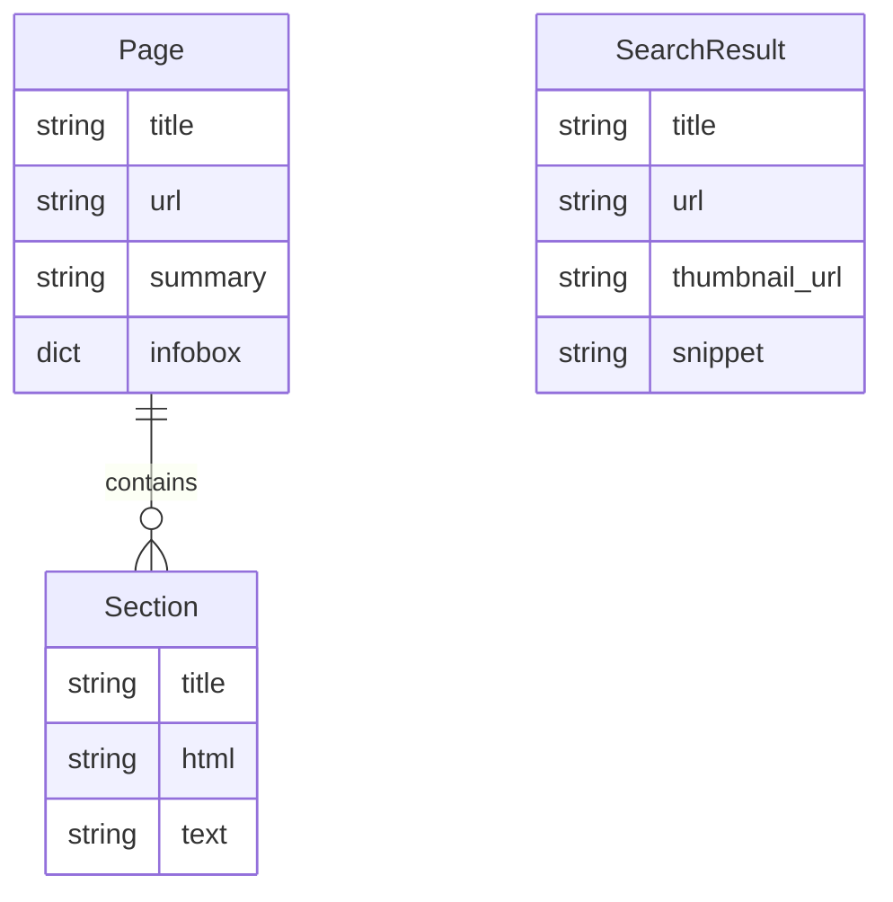
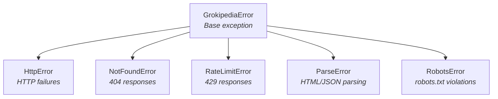

# Grokipedia SDK Architecture

This document provides a technical overview of the Grokipedia SDK architecture for developers looking to understand, contribute to, or extend the codebase.

For usage documentation, see the [README](../README.md).

## Table of Contents

- [Overview](#overview)
- [Architecture Diagram](#architecture-diagram)
- [Class Diagram](#class-diagram)
- [Sequence Diagrams](#sequence-diagrams)
- [Data Models](#data-models)
- [Module Reference](#module-reference)
- [Key Concepts](#key-concepts)
- [Exception Handling](#exception-handling)

---

## Overview

The Grokipedia SDK is a read-only Python client for accessing [Grokipedia](https://grokipedia.com), an AI-generated online encyclopedia. It provides:

- **Article fetching** with structured parsing (title, summary, sections, infobox)
- **Search** via sitemap (default) or API
- **Rate limiting** and **caching** for responsible usage
- **robots.txt compliance** built-in
- **CLI** for command-line access

### Quick Install

```bash
pip install grokipedia-sdk        # Base package
pip install grokipedia-sdk[cli]   # With CLI
pip install grokipedia-sdk[dev]   # With dev tools
```

---

## Architecture Diagram

The SDK follows a layered architecture with clear separation of concerns:



---

## Class Diagram



---

## Sequence Diagrams

### Page Fetching



### Search (Sitemap-based, Default)



### Search (API-based)



---

## Data Models



### Field Descriptions

#### Page
| Field | Type | Description |
|-------|------|-------------|
| `title` | str | Article title from `<h1>` |
| `url` | str | Full URL of the article |
| `summary` | str | Introduction text before first `<h2>` |
| `sections` | List[Section] | All article sections |
| `infobox` | Dict[str, str] | Key-value data from first table (optional) |

#### Section
| Field | Type | Description |
|-------|------|-------------|
| `title` | str | Section heading text |
| `html` | str | Raw HTML content |
| `text` | str | Plain text (whitespace normalized) |

#### SearchResult
| Field | Type | Description |
|-------|------|-------------|
| `title` | str | Article title |
| `url` | str | Article URL |
| `thumbnail_url` | str | Image URL (optional, API only) |
| `snippet` | str | Preview text (optional, API only) |

---

## Module Reference

| Module | File | Purpose |
|--------|------|---------|
| **Client** | `client.py` | Main SDK orchestrator, public API |
| **HTTP** | `http.py` | HTTP requests, caching, rate limiting |
| **Parser** | `parser.py` | HTML to data model conversion |
| **Models** | `models.py` | Data classes: Page, Section, SearchResult |
| **Robots** | `robots.py` | robots.txt parsing and compliance |
| **Sitemap** | `sitemap.py` | XML sitemap parsing |
| **Exceptions** | `exceptions.py` | Custom exception hierarchy |
| **CLI** | `cli.py` | Command-line interface (click) |

### Dependencies

```
grokipedia-sdk
├── requests >=2.32.0      # HTTP client
├── beautifulsoup4 >=4.12.0 # HTML/XML parsing
└── lxml >=4.9.0           # Parser backend

[cli]
└── click >=8.0.0          # CLI framework
```

---

## Key Concepts

### Rate Limiting

The SDK enforces rate limiting to be a good citizen:

```python
# Default: 30 requests per minute
client = GrokipediaClient(requests_per_minute=30)
```

- **Thread-safe**: Uses `threading.Lock` for concurrent access
- **Automatic delay**: Sleeps between requests if needed
- **Per-client**: Each client instance has its own limit

### Caching

In-memory LRU cache with TTL for improved performance:

```python
# Default: 5 minute TTL, unlimited entries
client = GrokipediaClient(
    cache_ttl=300.0,      # seconds
    max_cache_entries=100  # limit cache size
)

# Manual cache control
client.clear_cache()
size = client.get_cache_size()
```

- **Thread-safe**: Uses `threading.Lock`
- **LRU eviction**: Least recently used entries removed when limit reached
- **TTL-based expiration**: Entries expire after configured time

### robots.txt Compliance

The SDK respects robots.txt by default:

```python
# Default: check robots.txt
client = GrokipediaClient(respect_robots=True)

# Strict mode: raise error if API endpoints are allowed
client = GrokipediaClient(robots_strict=True)

# Skip robots.txt check (not recommended)
client = GrokipediaClient(respect_robots=False)
```

**Required paths** (must be allowed):
- `/` (homepage)
- `/page/*` (articles)
- `/sitemap.xml`

**API paths checked**:
- `/api/`, `/api/full-text-search`, etc.
- If allowed when `enable_api_search=True`: API search is auto-disabled

### Search Modes

| Mode | Default | Data Source | Features |
|------|---------|-------------|----------|
| **Sitemap** | Yes | XML sitemaps | robots.txt compliant, title-only matching |
| **API** | No | /api/full-text-search | Full-text search, snippets, pagination |

```python
# Sitemap search (default)
client = GrokipediaClient()
results = client.search("Mars")

# API search (when robots.txt allows)
client = GrokipediaClient(enable_api_search=True)
results = client.search("Mars", page=2, limit=20)
```

---

## Exception Handling



### When Exceptions Are Raised

| Exception | Raised When |
|-----------|-------------|
| `HttpError` | HTTP 4xx/5xx (except 404, 429), network errors |
| `NotFoundError` | HTTP 404, article not found |
| `RateLimitError` | HTTP 429 Too Many Requests |
| `ParseError` | Invalid HTML/XML/JSON, unexpected page structure |
| `RobotsError` | robots.txt fetch failed, strict mode violation |

### Example Error Handling

```python
from grokipedia import GrokipediaClient
from grokipedia.exceptions import (
    GrokipediaError,
    NotFoundError,
    HttpError,
    RateLimitError,
)

client = GrokipediaClient()

try:
    page = client.get_page("Nonexistent Article XYZ")
except NotFoundError:
    print("Article not found")
except RateLimitError:
    print("Too many requests, try again later")
except HttpError as e:
    print(f"HTTP error: {e}")
except GrokipediaError as e:
    print(f"SDK error: {e}")
```

---

## Contributing

See [README.md](../README.md#development) for development setup and workflow.

### Code Quality Standards

- **Tests**: `pytest` with 89%+ coverage
- **Types**: `mypy` strict mode
- **Format**: `black` + `isort`
- **Lint**: `pylint` (9.88/10)
